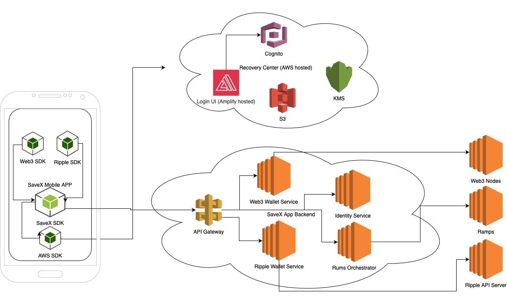

# Ripple MPC Wallet Service

An Open Source Component for  SaveX Wallet Microservices Architecture to Support Ripple**

**Primary Objectives:**

1. Creation of a secondary key for multi-signing, securely storing the Share B Master key pair.
2. Preparation of transactions for signing.
3. Signing transactions with the secondary key and sending them to Ripple.
4. Caching transaction history.

For a better understanding of the role of this service, let's delve into the complete architecture of SaveX Wallet:

AWS services, such as KMS (Key Management Service) and S3 (Simple Storage Service). Additionally, we employ the Web3 SDK for creating Ethereum Virtual Machine (EVM) wallets and signing transactions. The application also integrates the Ripple SDK, which is responsible for generating master keys and regular keys, as well as signing transactions.

In this architecture, the Master Key is divided into three parts using the Secret Sharing Scheme (SSS):

1. **Share A**: This share is stored on the user's device.
2. **Share B**: This component is managed within the SaveX microservice.
3. **Share C**: Share C is held at the Recovery Center.

This architecture enables secure key management and transaction signing while maintaining separation between user devices, SaveX services, and the external Recovery Center.

The **Recovery Center** operates as an independent provider for storing segments of recovery keys. These keys are securely encrypted using AWS KMS (Key Management Service) and then stored within AWS S3 (Simple Storage Service). To facilitate interaction with the Recovery Center, users are required to create an autonomous AWS Cognito account, separate from their SaveX credentials.

To provide a better understanding of how the SaveX protocol works for the creation and recovery of accounts, let's describe these use cases:

**Account Creation:**

1. The user creates a SaveX account (leveraging the Identity Center microservice).
2. The user generates a Master Key Pair on their device.
3. The Master Key is divided into three layers (shares).
4. The user creates an account with the Recovery Center.
5. Using Recovery Center, Share C is encrypted and stored in AWS.
6. Share B is transmitted to the Ripple Wallet Service, where it is encrypted with the service's key and stored in the database.
7. On the user's device, a Regular Key Pair is created.
8. Ripple Wallet Service also generates a Regular Key Pair.
9. The Wallet Service funds the balance of the new account.
10. The Wallet Service creates a SignerListSet transaction.
11. The client signs the transaction and sends it to Ripple. At this point, the full Master Key Pair is forgotten, and it is only used in scenarios for recovering access to the wallet.

Certainly, let's describe the two scenarios for key recovery within the SaveX protocol:

**Scenario 1: User Loses Share A and/or Regular Key Pair on Their Device**

1. The user logs in to both the Recovery Center and SaveX.
2. The user's device receives Share B and Share C, from which the Master Key is reconstructed.
3. New Regular Key Pairs are generated, and a new SignerListSet transaction is executed.

In this scenario, the user can recover their account by leveraging the Recovery Center, even if Share A or the Regular Key Pair on their device is lost. This process allows for the restoration of account access and the generation of new keys for security.

**Scenario 2: Loss of Access to SaveX Backend (e.g., Company Bankruptcy)**

1. The user obtains Share C.
2. By combining Share A and Share C, the user retrieves the Master Key.
3. The user can then transfer funds to another account or export the Master Key to another wallet.

In this scenario, even if access to the SaveX backend is lost due to unforeseen circumstances, the user retains control over their account by using Share C and a combination of Share A and C to access the Master Key. This ensures the user's continued control over their assets.

